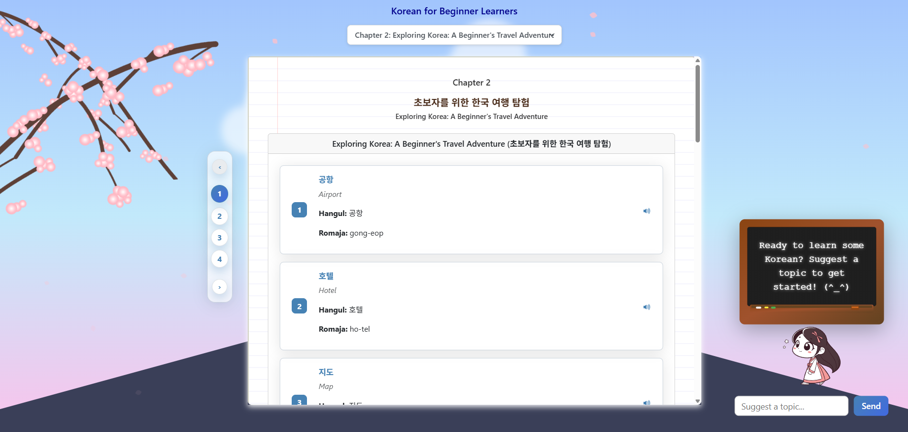

# LanguageLearning

An AI-powered language learning application designed to generate dynamic, personalized lessons. This project leverages large language models to create chapters, vocabulary, grammar explanations, and interactive exercises on demand.

## Preview



## Key Features

*   **Dynamic Lesson Generation**: Users can request a new lesson book on a specific topic, language, and difficulty level.
*   **Storybook Generation**: In addition to lessons, users can generate narrative-driven short stories with vocabulary support.
*   **Illustrated Storybooks**: The storybook feature is now fully integrated with an image generation model to create illustrated pages.
*   **AI-Powered Content**: All lesson and story content is generated by an AI model, ensuring unique and varied learning material.
*   **Interactive Proofreading**: Users can submit sentences for practice and receive AI-generated corrections and feedback in real-time.
*   **Robust AI Interaction**: The backend features a resilient, state-machine-driven engine for text-based AI interaction, which handles response validation, sanitization, and automatic retries.
*   **Efficient Data Fetching**: For complex, nested data structures, the application uses a modern jOOQ-based strategy to fetch the entire object graph in a single, efficient database query, avoiding common JPA pitfalls like the N+1 problem.
*   **Real-time Progress Updates**: The frontend receives live progress updates via WebSockets for long-running generation jobs.
*   **Multi-Language Support**: The architecture is designed to support multiple languages by configuring different AI models and prompts.
*   **Containerized Development Environment**: The entire application stack (frontend, backend, AI, database) is managed via Docker Compose for easy setup and consistent environments.

## Tech Stack

| Category      | Technology                                                                                             |
|---------------|--------------------------------------------------------------------------------------------------------|
| **Backend**   | Java 21, Spring Boot 3, Spring for GraphQL, Spring Data JPA, **jOOQ**, Spring AI, Project Reactor      |
| **Frontend**  | React, TypeScript, Redux Toolkit (RTK Query), GraphQL, SCSS                                              |
| **AI**        | Ollama (for text), Stable Diffusion (AUTOMATIC1111, for images)                                        |
| **Database**  | PostgreSQL                                                                                             |
| **DevOps**    | Docker & Docker Compose                                                                                |

## Architecture Overview

The application is designed with a clean separation of concerns, containerized into four main services: `frontend`, `backend`, `ai`, and `postgres`.

## Backend Architecture

The backend is the core of the application, featuring a sophisticated architecture designed for robustness and maintainability. It is built around three custom-designed workflow tools, each chosen for a specific type of problem.

### `SyncWorkflow` (Synchronous Pipeline)
Used for synchronous, transactional setup tasks that must complete atomically. The lessonChapter preparation process is a perfect example, where a sequence of database operations (finding a book, creating a lessonChapter shell) is executed in a clean, declarative pipeline. This ensures data integrity before handing off to a long-running asynchronous job.

### `StateMachine` (Blocking, Asynchronous)
Used for long-running, job-based processes like lessonChapter generation. It orchestrates the sequential creation of lesson components (metadata, vocabulary, grammar, etc.) and sends progress updates to the frontend. It uses a clean `State -> Action` mapping in its configuration, making the workflow easy to read and maintain.

### `ReactiveStateMachine` (Non-Blocking, Asynchronous)
Used internally by the `AIEngine` to handle the complex, branching logic of AI response generation. This state machine also uses a `State -> Action` model and manages the entire lifecycle of an AI call, including:
    1.  **Generation**: Calling the AI model.
    2.  **Validation**: Parsing the response and validating it against a JSON schema.
    3.  **Sanitization**: Attempting to automatically fix common validation errors.
    4.  **Retrying**: Looping back to the generation step with feedback if validation or sanitization fails.

### Data Access Strategy
The backend employs a hybrid data access strategy to leverage the strengths of different tools:
*   **Spring Data JPA**: Used for all simple CRUD (Create, Read, Update, Delete) operations. Its simplicity and convention-over-configuration approach make it ideal for standard entity management.
*   **jOOQ (Java Object Oriented Querying)**: Used for complex, performance-critical read queries. For fetching deeply nested object graphs (like a `StoryBook` with all its stories, pages, and paragraphs), jOOQ's `multiset` operator is used to generate a single, highly efficient SQL query that leverages PostgreSQL's native JSON functions. This avoids the N+1 query problem and the `MultipleBagFetchException` common with complex JPA `JOIN FETCH` operations.

### Other Key Components

*   **`AIEngine`**: A lean, reactive service that acts as the central engine for all AI interactions. It has been refactored to support two distinct pipelines: `generate()` for text-based requests using `AIRequest`, and `generateImages()` for image generation using a separate `AIImageRequest`.
*   **Request Builders**: The `AIRequest` and `AIImageRequest` classes provide a fluent, type-safe builder pattern for constructing AI tasks, ensuring all necessary parameters are provided before execution.

## AI Service

A dedicated Docker container runs the Ollama service, exposing the language models to the backend. This isolates the heavy AI workload and allows for independent scaling and management (e.g., running on a dedicated GPU instance without affecting the rest of the application).

## Getting Started

### Prerequisites

*   Docker and Docker Compose
*   An NVIDIA GPU with the appropriate drivers (for the GPU profile)
*   A `.env` file configured in the project root.

### Configuration

1.  Create a `.env` file in the root directory of the project. You can copy `.env.example` as a template.
2.  Populate the `.env` file with your desired database credentials. These will be used by both the `postgres` and `backend` services.

```env
# PostgreSQL Database Configuration
POSTGRES_DB=your_db_name
POSTGRES_USER=your_user
POSTGRES_PASSWORD=your_password

# MinIO Object Storage Configuration
MINIO_ROOT_USER=your_minio_user
MINIO_ROOT_PASSWORD=your_minio_password

# AI Service Configuration
# This URL points to the Ollama service. In the Docker Compose setup, 'ai' is the service name.
SPRING_AI_OLLAMA_BASE_URL=http://ai:11434

# Image Generation API Configuration
# This URL points to the Stable Diffusion (AUTOMATIC1111) API service.
SPRING_AI_IMAGE_BASE_URL=http://image-api:7860
```

## Running the Application

The application can be run using one of two Docker Compose profiles, depending on your hardware.

### With GPU Support (Recommended)

This profile runs the AI service on an NVIDIA GPU for significantly faster performance.

```sh
docker-compose -f docker-compose.gpu.yml up --build
```

### With CPU Only

This profile runs all services on the CPU. AI generation will be noticeably slower.

```sh
docker-compose -f docker-compose.cpu.yml up --build
```

### Accessing the Services

*   **Frontend**: http://localhost:3000
*   **Backend GraphQL Playground**: http://localhost:8080/graphiql
*   **Ollama AI Service**: http://localhost:11434

## Local Development and Testing

While the primary way to run the application is via Docker Compose, the backend is configured to support local development and testing directly from an IDE (like IntelliJ IDEA).

### Running Integration Tests

The integration tests require a running PostgreSQL database and up-to-date jOOQ generated code.

1.  **Start the Database**: From the project root, start only the PostgreSQL container:
    ```sh
    docker-compose up -d postgres
    ```
2.  **Generate jOOQ Code**: The build script is configured to connect to the local database instance. From your IDE's Gradle tool window, run the `backend > Tasks > jooq > generateJooq` task. This only needs to be done once after making changes to the database schema (i.e., modifying a JPA `@Entity` class).
3.  **Run Tests**: You can now run individual integration tests (like `StoryBookRepositoryIntegrationTest`) directly from your IDE using the "play" button next to the test class or method.

## Project Structure

*   `/`
    *   `backend/`
        *   `src/main/java/com/example/language_learning/`
            *   `ai/` - AI response DTOs and generation logic.
            *   `config/` - Spring, GraphQL, State Machine, and Pipeline configurations.
            *   `lessonbook/` - Feature module for structured lessons.
            *   `security/` - Spring Security configuration, JWT service.
            *   `shared/` - Code shared across multiple features (base entities, shared DTOs, etc.).
            *   `storybook/` - Feature module for narrative stories.
            *   `user/` - User and settings management.
        *   `dockerfiles/` - Dockerfiles for the backend and AI services.
    *   `docs/`
        *   `images/` - Contains diagrams and other visual assets.
    *   `frontend/`
        *   `src/`
            *   `app/` - Redux store setup and core components.
            *   `features/` - Feature-specific components and logic (`lessonBook`, `storybook`, etc.).
            *   `hooks/` - Global, reusable React hooks.
            *   `pages/` - Top-level page components.
            *   `shared/` - Shared code used across the frontend application.
                *   `api/` - RTK Query API slices.
                *   `components/` - Globally shared, simple UI components.
                *   `types/` - Core TypeScript type definitions (`dto.ts`).
                *   `ui/` - More complex, shared UI components.
            *   `widgets/` - Composite components made of smaller features/components.
        *   `.env`: **Note:** If you experience `ENOMEM: not enough memory` errors when running the frontend in Docker, ensure this file exists and contains `WATCHPACK_POLLING_IGNORED=**/node_modules/**` to prevent the file watcher from consuming too much memory.
    *   `docker-compose.gpu.yml` - Docker Compose configuration for GPU.
    *   `docker-compose.cpu.yml` - Docker Compose configuration for CPU.
    *   `.env.example` - Template for environment variables
